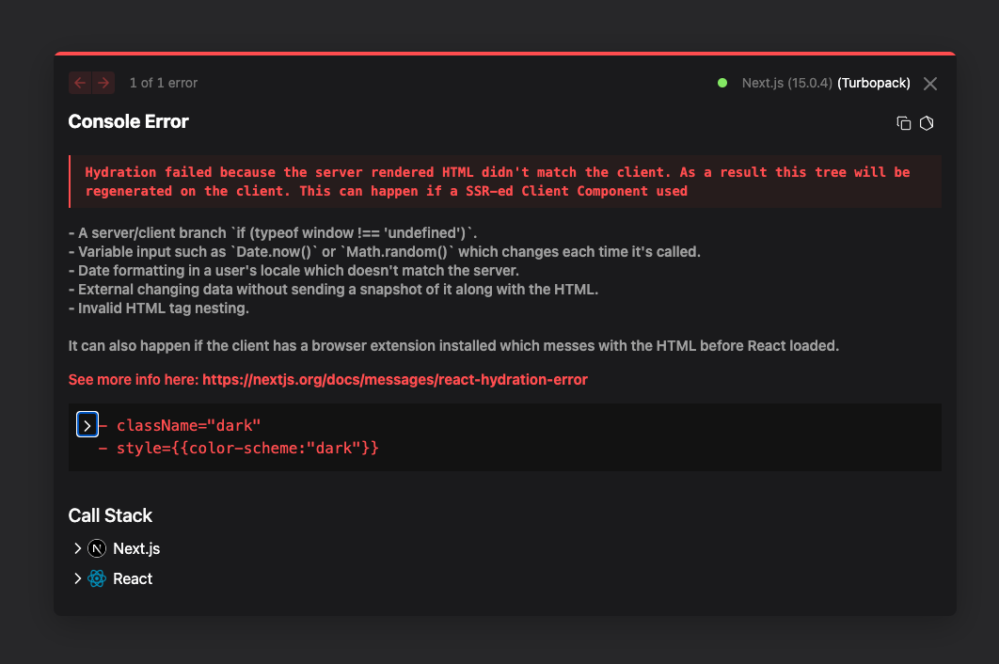
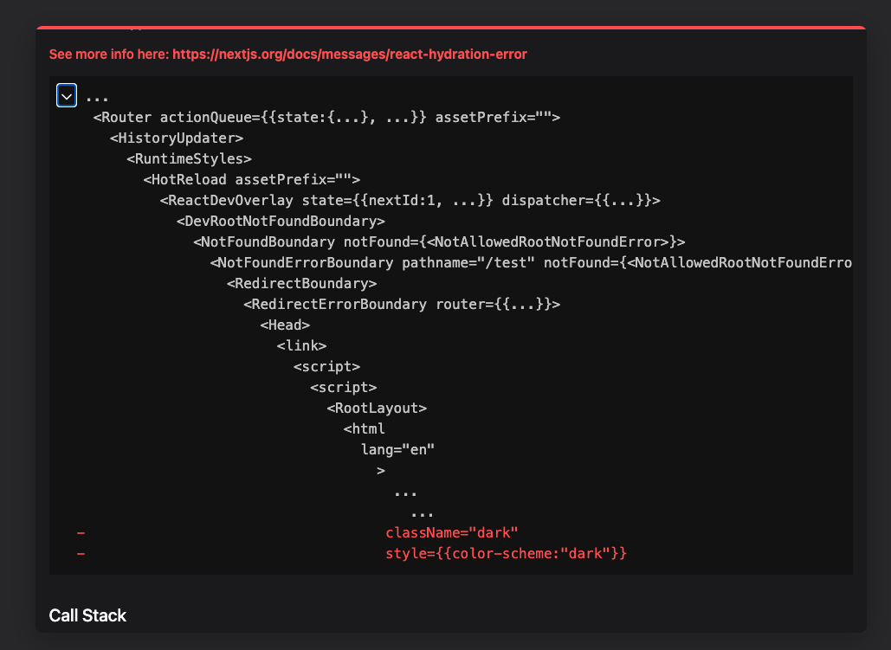

# Next 15 + Shadcn Theme Provider - Hydration Error

Brand new install of Next 15 + React 19 with Shadcn/ui on 12/06/2024. Adding the theme provider into a nested layout causes
a hydration error. This wasn't the case in Next 14 + React 18.

The ThemeProvider is located at `app/(test)/layout.tsx`. The reason that it isn't in the root layout is that part of the site isn't dark mode compatible.

You can clone this repository and to go http://localhost:6002/test to view the issue. Screenshots attached below

